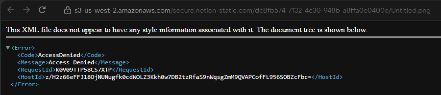
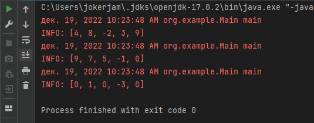
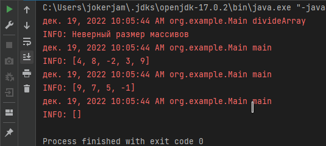
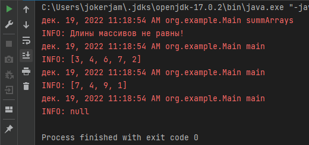
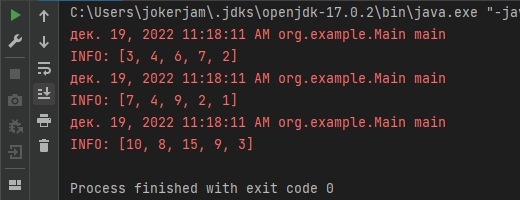

# Исключения в программировании и их обработка

## Обработка ошибок в программировании

### Задача 1

Реализуйте 3 метода, чтобы в каждом из них получить разные исключения.

Сриншот

---

### Задача 2

Посмотрите на код, и подумайте сколько разных типов исключений вы тут сможете получить?

Возможные ошибки:

+ аргументом метода в массив строк может быть передан null - получим NullPointerException при попытке получения размерности 
+ в цикле по j используется "магическое" число, если размерность массива окажется меньше - получим выход за пределы индекса ArrayIndexOutOfBoundsException
+ элементы массива могут содержать не только числовые символы, что вызовет NumberFormatException при попытке получить int val

---

### Задача 3

Реализуйте метод, принимающий в качестве аргументов два целочисленных массива, и возвращающий новый массив, каждый элемент которого равен разности элементов двух входящих массивов в той же ячейке. Если длины массивов не равны, необходимо как-то оповестить пользователя.

Если в метод переданы массивы разной длины - метод вернет пустой массив.

Скриншоты

---

### Задача 4

Реализуйте метод, принимающий в качестве аргументов два целочисленных массива, и возвращающий новый массив, каждый элемент которого равен частному элементов двух входящих массивов в той же ячейке. Если длины массивов не равны, необходимо как-то оповестить пользователя. Важно: При выполнении метода единственное исключение, которое пользователь может увидеть - RuntimeException, т.е. ваше

При делении на 0 исключение не вызывается, значению массива присваивается 0.

Скриншоты

---

### Задача 5*

Реализуйте метод, принимающий в качестве аргументов два целочисленных массива, и возвращающий новый массив, каждый элемент которого равен сумме элементов двух входящих массивов в той же ячейке. Если длины массивов не равны, необходимо как-то оповестить пользователя.

Скриншоты

---

### Задача 6*

Реализуйте метод, принимающий в качестве аргументов двумерный массив. Метод должен проверить что длина строк и столбцов с одинаковым индексом одинакова, детализировать какие строки со столбцами не требуется. Как бы вы реализовали подобный метод.

Скриншоты

---